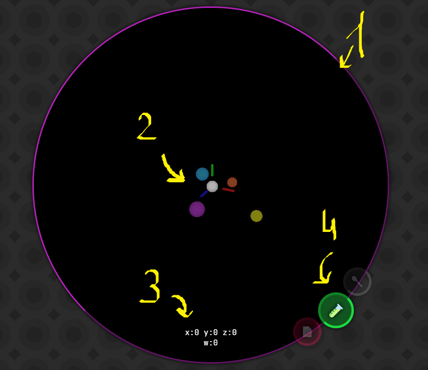
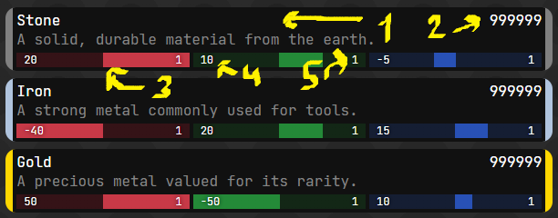

# Alchemy Game

## English

This project is the realization of a long-time dream — an alchemy game that is not overly simple or boring, offering true creative freedom and actually reflecting the spirit of real alchemy.  
Special thanks to *Potion Craft* for inspiring the implementation of key aspects of this game.

---

### 📘 Beginner's Guide

Below is a guide designed to teach you the basics of the game:

#### 🗺️ Map Interface

1. **The Map** — This circle shows a projection of the 4D space where the game operates.  
2. **Recipe Bubbles** — Finishing a potion at this location will give you a known result.  
3. **Coordinates** — Helps track where the potion currently is.  
4. **"Brew" Button** — Completes the potion and adds the result to your inventory.

---

### 🧺 Inventory

In the inventory, you can see all the ingredients currently available to you. (For now, the game runs in creative mode — all base ingredients are unlocked.)

Each ingredient panel includes:

1. Name and description  
2. Quantity  
3. Position and weight indicator on the axis  
4. Axis position  
5. Axis weight

Clicking on an ingredient allows you to select how much of it you want to add to the cauldron.

Once you add two or more ingredients, you can press the **"Brew"** button to receive the resulting potion.

> For example: Try mixing equal amounts of gold and silver — the result will be *Electrum*.  
> Experiment! Create your own recipes! Remember, sometimes you’ll get something useless, and other times you’ll create something that may seem insignificant at first — but will become a key ingredient in something truly great.

---

## Українська

Цей проєкт — втілення моєї давньої мрії: гра про алхімію, яка не буде занадто простою чи нудною, а натомість надає величезну свободу дій та **реально** показує алхімію.  
Особлива подяка *Potion Craft* за натхнення в реалізації ключових аспектів гри.

---

### 📘 Посібник для початківців

Нижче наведено керівництво, яке навчить вас основам гри:

#### 🗺️ Інтерфейс карти

1. **Карта** — У цьому колі зображено проєкцію 4D-простору, в якому працює гра.  
2. **Бульбашки рецептів** — Якщо завершити зілля в цій точці, отримаєте відомий результат.  
3. **Координати** — Допомагають відстежити місцезнаходження зілля.  
4. **Кнопка "Зварити"** — Завершує створення зілля і додає його в інвентар.

---

### 🧺 Інвентар

В інвентарі зібрані всі інгредієнти, якими ви володієте. (Зараз гра працює у творчому режимі — всі базові інгредієнти доступні.)

Кожен інгредієнт містить:

1. Назву та опис  
2. Кількість  
3. Індикатор позиції та ваги по осі  
4. Позицію по осі  
5. Вагу по осі

Клікнувши на інгредієнт, ви зможете вибрати, скільки додати в котел.

Після додавання двох або більше інгредієнтів натисніть **"Зварити"**, щоб отримати результат.

> Наприклад: Додайте рівну кількість золота і срібла — отримаєте *електрум*.  
> Експериментуйте, створюйте власне! Пам’ятайте: іноді ви отримаєте щось непотрібне, а іноді — щось, що згодом стане основою чогось справді великого.

---

## Русский

Этот проект — воплощение моей давней мечты: игра про алхимию, которая не была бы слишком простой или скучной, а давала бы огромную свободу действий и **по-настоящему** показывала алхимию.  
Особая благодарность *Potion Craft* за вдохновение в реализации ключевых аспектов игры.

---

### 📘 Руководство для начинающих

Ниже представлено руководство, направленное на обучение основам игры:

#### 🗺️ Интерфейс карты

1. **Карта** — В этом круге отображается проекция 4D-пространства, в котором работает игра.  
2. **Пузырьки рецептов** — Если завершить зелье в этой точке, вы получите уже известный результат.  
3. **Координаты** — Помогают понять, где находится зелье.  
4. **Кнопка "Сварить"** — Завершает приготовление зелья и добавляет результат в инвентарь.

---

### 🧺 Инвентарь

В инвентаре представлены все доступные вам ингредиенты. (В данный момент игра работает в режиме креатива — все базовые ингредиенты уже выданы.)

Панель каждого ингредиента включает:

1. Название и описание  
2. Количество  
3. Индикатор позиции и веса по оси  
4. Положение по оси  
5. Вес по оси

Нажав на ингредиент, вы можете выбрать, сколько добавить в котёл.

После добавления двух или более ингредиентов нажмите кнопку **"Сварить"**, чтобы получить результат.

> Пример: Добавьте равное количество золота и серебра — получится *электрум*.  
> Экспериментируйте, создавайте что-то своё! И помните: иногда вы получите что-то бесполезное, а иногда — то, что станет основным ингредиентом в чём-то по-настоящему великом.

---
